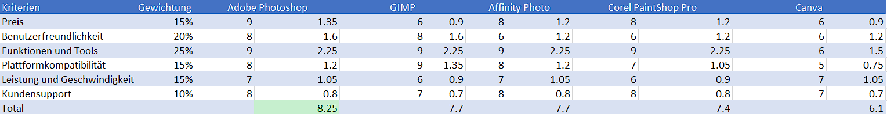

# Multimedia Seite

Die Webseite wurde mit Firebase gehostet: [Webseite](https://deckenbaumohamed.web.app/) <br>
Achtung Seite ist nicht für mobile entwickelt worden.

## Ziel
Das Ziel ist es eine Multimedia Seite zu erstellen.

## Voraussetzungen
Bevor Sie diese Applikation starten, stellen Sie sicher, dass folgende Dinge installiert sind:
* Nodejs
* allenfalls Docker

## Inbetriebnahme
Projekt herunterladen
<br/>
```git clone https://github.com/azhaarmohamed20/versicherungsrechner.git```
<br/>

### Projekt bauen
Um das Projekt zu starten müssen Sie es mit ```$ npm install ``` builden oder 
Sie machen es mit Docker ```$ docker build .```  dafür müssen sie Docker installiert haben.

### Starten der App
Mit folgendem Befehl können sie die App starten
<br/> ```$ npm start```

## Design Prozess
Ich habe zu Beginn dieses Projekt mir erst Gedanken dazu gemacht, über welches Thema meine <br/>
Seite geht. Ich kam schnell zur Entscheidung es über Deckenbau zu machen.

### Wireframe
Für mein Seite habe ich zuerst ein Basic Wireframe erstellt um eine Idee zu haben wie meine <br/>
Aussehen sollte. Siehe unten
[Wireframe](./Doku/Wireframe%20Deckenbau%20Gmbh.pdf)

### Entscheidungsmatrix
Als nächstes musste ich eine Toolauswahl machen. Ich habe eine Toolauswahl zu Bildbearbeitungsprogrammen <br/>
gemacht. Dieser sieht wie folgt aus.


## Über Mich
Ich bin Azhaar Mohamed und gehe in die IMS. Diese Projekt habe ich für die Schule erstellt <br/>
Ich bin 17 Jahre alt und möchte gerne Applikationsentwicklerin werden.


## Umsetzung & Reflexion
Die Umsetzung meines Projekts lief gut. Ich konnte alles so umsetzen wie ich es geplant hatte <br/>
Ich habe mein Wissen in React nochmals verbessert und hatte die Möglichkeit Tailwind <br/>
kennenzulernen. Ich habe viele neue Techniken angewandt und fühle mich sicherer im erstellen <br/>
von Frontend Applikationen
